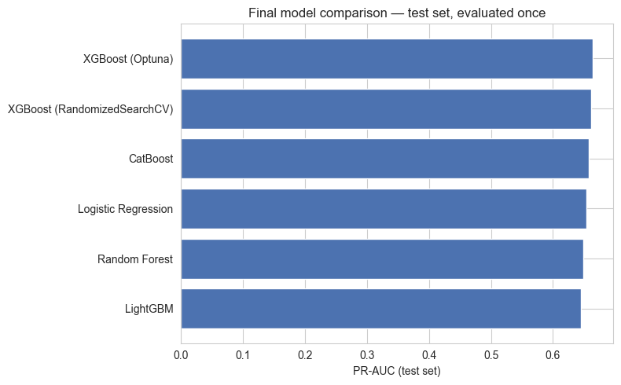
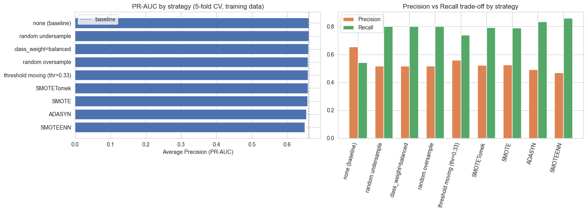
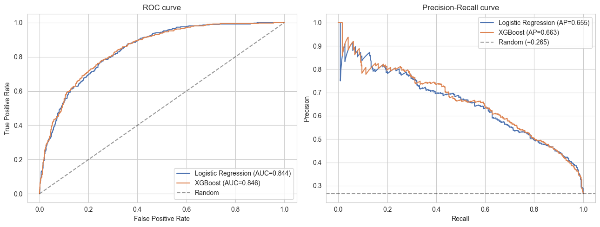
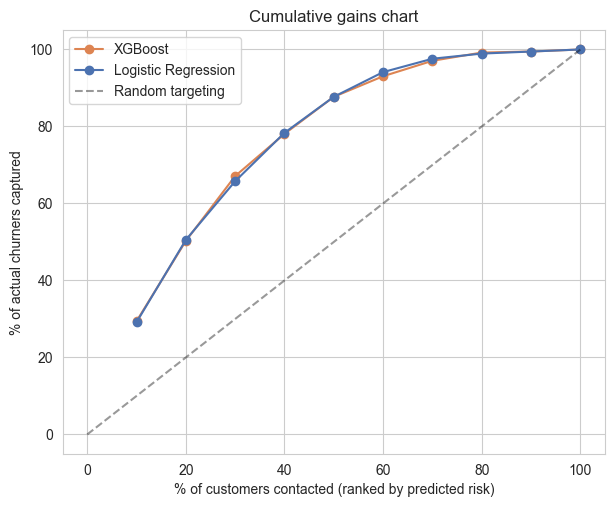
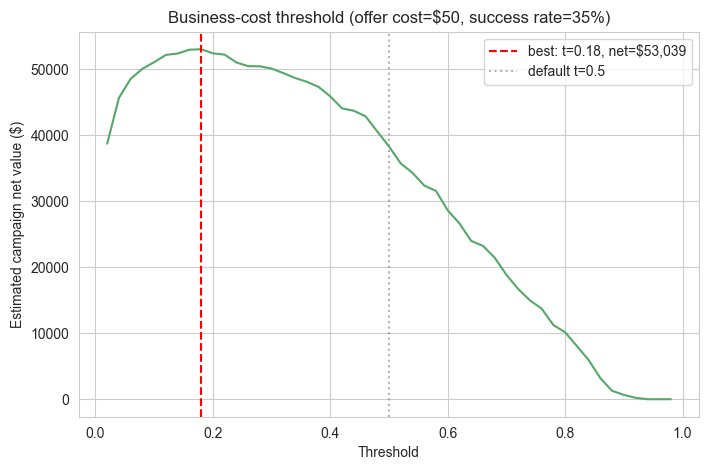
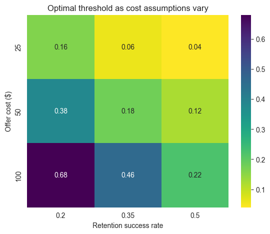
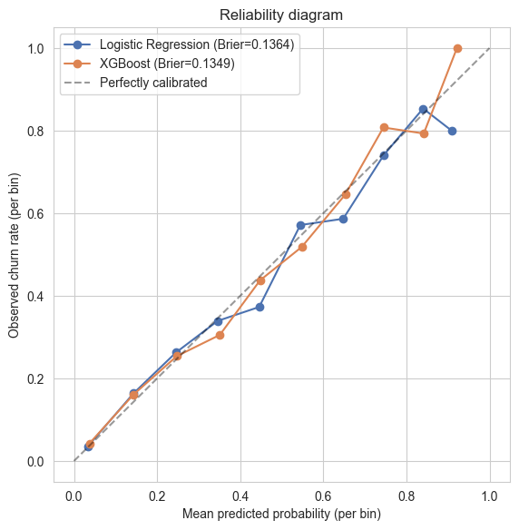
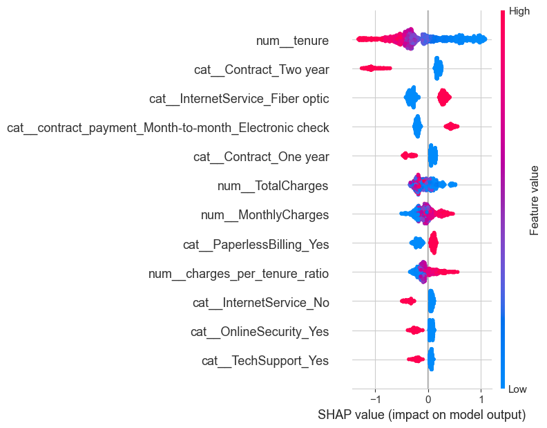
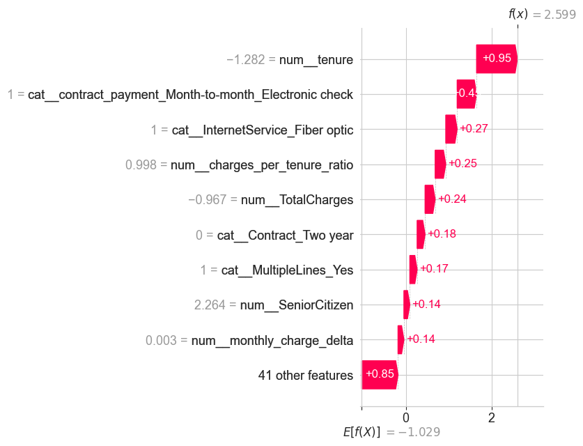
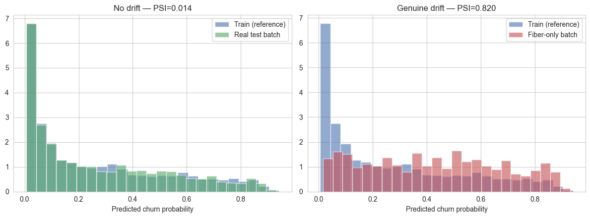

# Telco Customer Churn — A Complete ML Reference

Six self-contained, fully-executed Jupyter notebooks that take one dataset from raw CSV to a monitored, deployable scoring service — covering everything a data scientist is realistically expected to know about a binary classification problem: imbalance handling, feature engineering, model selection, evaluation economics, interpretability, and deployment.

This isn't a single "here's my churn model" notebook. It's a reference built to be read end-to-end, where almost every section makes a specific technical claim and then proves it — with a leakage bug reproduced on purpose, a target-encoding leak measured at 0.975 vs. 0.68 AUC on identical signal, and a real production pipeline serialized and served behind a FastAPI endpoint.

## Why this exists

An earlier version of this project (`xgboost_modeling.ipynb`) reported a headline **0.8565 ROC-AUC** after searching ~500–1,000 random hyperparameter configurations and evaluating each one directly against the test set. That number is inflated — not because of a coding mistake, but because of a subtle, extremely common methodology error: letting the same held-out data drive both hyperparameter selection *and* final reporting.

Notebook `03_model_selection_and_tuning.ipynb` doesn't just fix this. It **reproduces the exact size of the inflation** with a bootstrap simulation — resampling a single, fixed, unchanging model's predictions 300 times and showing that the *maximum* of those noisy readings alone lands at 0.8561, almost exactly matching the original's reported 0.8565. The honest, CV-safe number for this problem is closer to **0.845–0.847 ROC-AUC**. That gap, and being able to explain precisely where it comes from, is the reason this repo exists.

## Dataset

[IBM Telco Customer Churn](https://www.kaggle.com/datasets/blastchar/telco-customer-churn) — 7,043 residential telecom customers, 20 features (demographics, account info, subscribed services) plus a binary `Churn` label.

- **7,043 customers**, **26.5% churn rate** (1,869 churners) — a moderate, not extreme, class imbalance
- 19 predictive features: 4 numeric (`tenure`, `MonthlyCharges`, `TotalCharges`, `SeniorCitizen`), 15 categorical
- Train/test split: 5,634 / 1,409, stratified, `random_state=42` — identical across all six notebooks so results are directly comparable

## At a glance

| | |
|---|---|
| **Notebooks** | 6, fully executed with outputs, ~9k words of accompanying explanation |
| **Model families compared** | Logistic Regression, Random Forest, XGBoost, LightGBM, CatBoost |
| **Best test-set result** | XGBoost (Optuna-tuned) — ROC-AUC 0.847, PR-AUC 0.664 |
| **Business impact** | Contacting the riskiest 20% of customers catches ~50% of all churners (2.5x lift over random) |
| **Deployment artifacts produced** | One `sklearn.Pipeline`, a `joblib` model file, a FastAPI service, a model card, PSI drift monitoring |

## Headline model comparison

Final numbers from `03_model_selection_and_tuning.ipynb` — every model tuned via `RandomizedSearchCV`/`GridSearchCV`/Optuna on the training set only, then scored against the test set exactly once:

| Model | ROC-AUC | PR-AUC | F1 | Precision | Recall |
|---|---|---|---|---|---|
| **XGBoost (Optuna)** | **0.847** | **0.664** | 0.587 | 0.680 | 0.516 |
| XGBoost (RandomizedSearchCV) | 0.846 | 0.662 | 0.574 | 0.648 | 0.516 |
| CatBoost | 0.843 | 0.658 | 0.579 | 0.668 | 0.511 |
| Logistic Regression | 0.844 | 0.654 | 0.588 | 0.660 | 0.529 |
| Random Forest | 0.843 | 0.649 | 0.595 | 0.671 | 0.535 |
| LightGBM | 0.840 | 0.645 | 0.583 | 0.656 | 0.524 |

A paired significance test on the top two (Section 9, Notebook 3) finds the gap **not statistically distinguishable at p < 0.05** — with all six families landing within ~0.7 points of PR-AUC of each other, model choice here is defensibly about interpretability and operational simplicity, not raw score-chasing. That's the honest conclusion this repo argues for, not a hedge.



## The six notebooks

### `01_imbalance_handling.ipynb` — Handling Class Imbalance
A head-to-head comparison of every mainstream imbalance technique — class weighting, random over/undersampling, SMOTE, SMOTENC, ADASYN, SMOTEENN, SMOTETomek, and threshold moving — evaluated without leakage.

- Demonstrates the #1 leakage trap (resampling before splitting) directly: it inflates PR-AUC by **~18 points** by silently evaluating against an artificially balanced fold, on top of a smaller (~1 point ROC-AUC) genuine row-leakage effect
- Shows exactly what plain `SMOTE` does to one-hot encoded data: **92.9% of synthetic rows** end up with a fractional dummy value (e.g. `gender_Male = 0.838`) that can't occur in real data — and why `SMOTENC` fixes it
- **Finding:** at this dataset's ~26.5% imbalance, every resampling strategy lands within noise of the no-resampling baseline. Class weighting and threshold moving — both free — are the defensible choices here; the gap between techniques would only widen at more severe imbalance (1–5% positive rates)



### `02_feature_engineering_and_encoding.ipynb` — Feature Engineering, Encoding & Selection
Six engineered features (each justified by a one-sentence churn hypothesis), four encoding strategies compared, and three feature-selection methods.

- Makes the target-encoding leak tangible: naive in-sample encoding scores **0.975 AUC**, honest out-of-fold encoding scores **0.675 AUC** — on the exact same underlying signal
- VIF analysis catches a genuine bug in this notebook's own feature engineering: an engineered `monthly_charge_delta` feature is an **exact linear combination** of two other features already in the set (infinite VIF)
- RFECV selects 38 of 50 encoded features; the reduced set performs statistically indistinguishably from the full set (0.666 vs. 0.665 PR-AUC) — a legitimate argument for keeping the simpler, full pipeline

### `03_model_selection_and_tuning.ipynb` — Model Selection & Hyperparameter Tuning
Five model families, tuned three different ways (`RandomizedSearchCV`, `GridSearchCV`, Optuna/TPE), with early stopping done correctly and a paired significance test at the end.

- The bootstrap-noise demonstration described above, isolating *why* a single "pick the best test-set score" workflow is optimistic even with zero real overfitting
- CatBoost's `cat_features` constructor argument breaks `sklearn.clone()` — documented as a real, easy-to-hit gotcha with the fix (pass it to `.fit()` instead)
- Learning curves and a validation curve for bias/variance diagnosis; Optuna reaches a comparable score to `RandomizedSearchCV` in fewer total fits (12 trials vs. 75 fits)

### `04_evaluation_calibration_thresholding.ipynb` — Evaluation, Calibration & Thresholding
The full metric zoo (ROC-AUC, PR-AUC, F1/F2, KS statistic, Brier score, cumulative gains/lift), four threshold-selection methods, and calibration diagnostics.

- **Cumulative gains:** ranking customers by predicted risk and contacting the top decile alone captures **29.4%** of all churners (2.94x lift over random); the top 20% captures **50.3%** (2.5x lift); the top half captures **87.7%** (1.75x lift) — the chart that actually lands in a stakeholder conversation about campaign budget, more than a bare AUC number would
- A genuine **cost-based business threshold**: using average annual customer value, a $50 retention-offer cost, and a 35% offer-success rate, the optimal threshold (0.18) nets an estimated **$53,039** on the test set — well below the default 0.5 cutoff
- A full sensitivity heatmap shows how that optimal threshold moves as the cost assumptions change, rather than presenting one number as if it weren't conditional on unstated business inputs
- Reliability diagrams show both models are reasonably well-calibrated already; `CalibratedClassifierCV` is applied and discussed as a matter of routine anyway, since it's one line of code protecting every dollar figure built on top of the probabilities











### `05_interpretability.ipynb` — Interpretability
Logistic regression coefficients as odds ratios (via `statsmodels`), gain vs. permutation importance, SHAP (summary, dependence, per-customer waterfall), partial dependence/ICE, and a subgroup fairness check.

- A real debugging exercise: fitting an unregularized `statsmodels.Logit` fails silently against a rank-deficient design matrix until two more hidden collinearity sources are found and fixed — a categorical interaction term (`contract_payment`) that duplicates its own main effects, and six columns whose `"No internet service"` category is an exact duplicate of `InternetService == 'No'`
- **Fiber-optic internet is associated with ~20x the odds of churn** versus the reference category — the single strongest driver, consistent across odds ratios, gain importance, permutation importance, *and* SHAP
- A single high-risk customer (93.1% predicted churn probability) explained end-to-end via a SHAP waterfall plot — the operationally useful form of interpretability a retention agent can actually act on
- Subgroup check across gender and senior-citizen status finds no glaring precision/recall disparity, while correctly surfacing that senior citizens have a genuinely higher underlying churn rate (44% vs. 23%)





### `06_pipeline_deployment_monitoring.ipynb` — Pipeline, Deployment & Monitoring
Everything above collapses into one deployable object here.

- One `sklearn.Pipeline` — feature engineering (via `FunctionTransformer`), preprocessing, and the tuned XGBoost model — takes a single raw customer record in and returns a probability, matching every earlier notebook's numbers exactly (ROC-AUC 0.846, PR-AUC 0.663)
- Serialized with `joblib` plus a metadata sidecar (threshold, training date, performance snapshot); a load-from-disk round trip is verified to produce identical predictions
- A minimal, real `app.py` (FastAPI, `/health` and `/predict` endpoints) and `requirements.txt`, runnable with `uvicorn app:app --reload`
- **PSI-based drift monitoring**, validated on both a no-drift case (real test set, PSI = 0.014 — correctly reads as stable) and a deliberately constructed drifted batch (fiber-optic customers only, PSI = 0.82 — correctly flagged as a significant shift)
- A generated `MODEL_CARD.md` documenting intended use, performance, and known limitations
- Closes with an honest list of what a *real* production system needs beyond this notebook: a CI/CD retraining pipeline, a feature store, shadow-mode rollout, and a PSI-triggered (not calendar-triggered) retraining policy



## Repository structure

```
.
├── 01_imbalance_handling.ipynb
├── 02_feature_engineering_and_encoding.ipynb
├── 03_model_selection_and_tuning.ipynb
├── 04_evaluation_calibration_thresholding.ipynb
├── 05_interpretability.ipynb
├── 06_pipeline_deployment_monitoring.ipynb
├── WA_FnUseC_TelcoCustomerChurn.csv           # raw source data
├── app.py                                    # generated by notebook 06 — FastAPI scoring service
├── requirements.txt                          # generated by notebook 06 — serving-only dependencies
├── churn_pipeline.joblib                     # generated by notebook 06 — serialized end-to-end pipeline
├── churn_model_metadata.json                 # generated by notebook 06 — threshold, version, metrics
├── MODEL_CARD.md                             # generated by notebook 06
├── images/                                   # plots referenced in this README
│   ├── 01_pr_auc_by_strategy.png
│   ├── 03_final_model_comparison.png
│   ├── 04_roc_pr_curves.png
│   ├── 04_cumulative_gains.png
│   ├── 04_business_threshold_net_value.png
│   ├── 04_threshold_sensitivity_heatmap.png
│   ├── 04_calibration_reliability.png
│   ├── 05_shap_summary_beeswarm.png
│   ├── 05_shap_waterfall_high_risk_customer.png
│   └── 06_psi_drift_monitoring.png
└── README.md
```

Each notebook is self-contained — it reloads and re-cleans the raw CSV rather than depending on a prior notebook's saved state, so any one of them can be opened and run independently. Notebooks 2–6 share identical `load_and_clean()` / `engineer_features()` functions and the same `random_state=42` train/test split, so results are directly comparable across the series.

## Getting started

Clone the repo, then install the analysis dependencies used across the notebooks:

```bash
pip install pandas numpy matplotlib seaborn scikit-learn imbalanced-learn \
            xgboost lightgbm catboost optuna shap statsmodels joblib
```

Open any notebook in Jupyter and run top to bottom — each one rebuilds its own data from the included CSV.

To run the deployed scoring API instead (after executing `06_pipeline_deployment_monitoring.ipynb` once, to generate `churn_pipeline.joblib` and `churn_model_metadata.json`):

```bash
pip install -r requirements.txt
uvicorn app:app --reload
# POST a customer record to http://127.0.0.1:8000/predict
```

## Tech stack

- **Modeling:** scikit-learn, XGBoost, LightGBM, CatBoost, Optuna
- **Imbalance handling:** imbalanced-learn (SMOTE, SMOTENC, ADASYN, SMOTEENN, SMOTETomek)
- **Interpretability:** SHAP, statsmodels
- **Serving:** FastAPI, Pydantic, uvicorn, joblib
- **Core:** pandas, NumPy, matplotlib, seaborn

## Data source

[IBM Telco Customer Churn dataset](https://www.kaggle.com/datasets/blastchar/telco-customer-churn), as mirrored on Kaggle. See the dataset page for licensing terms.
